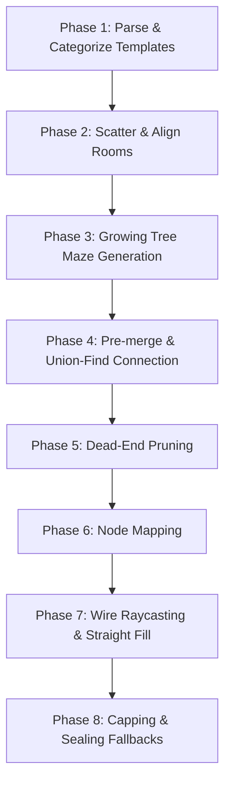

# Cobblemon Dungeon Engine (CDE)

## Transparency & AI-Use Disclaimer

This project utilizes Generative AI as a collaborative tool to assist in building the codebase and generating documentation. The AI acts as an assistant under human review and direction.

**Important Note on AI Usage**:
Generative AI is strictly limited to **code and documentation** generation. AI tools will **never** be used for generating any form of art, complex models, textures, or other creative assets for this project.

---

CDE is a modular Fabric mod integrating procedural dungeon generation, a custom group logic engine, and a real-time action combat engine for Cobblemon. It transforms the traditional turn-based Pokemon battle system into a dynamic, fast-paced action combat experience inspired by Mystery Dungeon and Pokepark titles, aswell as Legends ZA.

## Modular Architecture

The project is divided into three core modules, all toggleable via `config/cde/config.json`. This allows server owners to use only the features they want.

### 1. Dungeons Engine
- **Procedural Gen:** Uses pre-built `.nbt` rooms and hallways linked via a Hauberk-Jigsaw hybrid layout algorithm to generate fully-connected, non-overlapping dungeons.
- **Entry System:** Triggered via custom items and UIs to spawn instanced dimension spaces per-group.
- **Dynamic Palettes:** RuleStructureProcessor swaps templates with dungeon-specific palettes (e.g. Water/Lava hazards).
- **Group System:** Shared group inventory and scaled-down Pokemon hitboxes inside the dungeon.
- **Configuration:** Data-driven spawn tables, loot tables, and modifiers via JSON.

### 2. Battle Engine
- **Real-Time Combat:** Engage in real-time battles where you directly control the flow of combat.
- **Player Morphing:** Take direct control of your Pokemon with seamless transitions. Scaling hitboxes ensure accurate hit registration.
- **Custom Move Engine:** JSON-driven move system allowing developers to create and balance attacks with granular control over hitboxes, damage, recoil, and status effects.
- **UI:** Active UI elements display attacks, cooldowns, and combat feedback.
- **Status Effects & Items:** Deeply integrated statuses including poison, burn, paralysis, substitute, and weather-dependent multipliers. Uses an extensible subclass architecture for effects.

### 3. AI
- **Hostile AI:** Encounter wild hostile Pokemon that dynamically target and attack players or other entities using the Battle Engine.
- **Pet AI:** Owned Pokemon protect players in real-time.

---

## Usage & Configuration

In `config/cde/config.json`, server owners can toggle modules individually:
```json
"modules": {
  "dungeonsEnabled": true,
  "battleEngineEnabled": true,
  "aiEnabled": true
}
```
*Note: The AI module requires the Battle Engine module to be enabled.*

### Moves and Abilities
In `config/cde/` you can also find folders for `moves` and `abilities` `.json` files.
Some moves are already built-in; you can change them in the corresponding folder or add more.
- The `/cde reload` command reloads the JSONs directly in-game.
- (Abilities are currently not completely implemented)
- `config/cde/` also provides a `template.json` as well as a small guide for creating JSON files.

A detailed combat log can be toggled using the `/cde combatlog` command.

---

## Contributing

As this project utilizes a custom JSON schema for abilities and moves, contributors are welcome to help translate standard Cobblemon moves into the real-time engine format. Please see the `/config/cde/moves` directory for schema examples.

---

---

## Dungeon Generation Technical Details

### The Grid and Alignment System

The logical layout is simulated on a 2D grid of super-cells.
- **Super-Cell Dimensions:** Each grid cell corresponds to a physical area of `7 x 7` blocks in the Minecraft world (the standard cross-section width of hallways).
- **Hauberk Odd-Even Alignment:** 
  - Corridors and junctions are centered strictly at **odd-indexed grid coordinates** (e.g., (1, 1), (1, 3), (3, 3)).
  - The cell boundary walls are at **even-indexed coordinates** (e.g., (1, 2), (2, 1)).
  - Corner columns (even, even) (e.g., (2, 2)) represent structural corners and remain solid.
- **Doorway Centering:** Since CELL_SIZE = 7 blocks, indices within a single cell range from 0 to 6. The exact center of a cell corresponds to block index 3 (the 4th block). All room entrances and hallway templates must place their Jigsaw blocks at this relative center.
- **Collision Prevention:** Because paths are locked to odd-indexed lanes and separated by even-indexed walls, parallel corridors are guaranteed to have a minimum separation of 7 blocks. This eliminates structure overlap or clipping.

---

### Step-by-Step Generation Pipeline



#### Phase 1: Template Pool Parsing & Categorization
On mod initialization or dungeon load, the engine scans the registered templates and processes their Jigsaw structures:
- Jigsaws are parsed to determine their local offsets and horizontal directions.
- Jigsaw facing orientations are dynamically rotated based on the template's current rotation using `Rotation.rotate(jigsaw.facing())`. This keeps orientation vectors aligned to world coordinates.
- Templates are categorized into pools by their number of active Jigsaws:
  - **Crosses:** 4 Jigsaws.
  - **T-Junctions:** 3 Jigsaws.
  - **Corners / Straights:** 2 Jigsaws.
  - **Ends:** 1 Jigsaw.
  - **Rooms:** Arbitrary footprints (multiples of 7x7 cells) with any number of Jigsaws.

#### Phase 2: Room Placement & Footprint Projection
Rooms are scattered randomly on the grid:
- A room of physical block size W x D translates to grid cell dimensions wCells = W/7 and dCells = D/7.
- The start cell coordinates (rx, rz) are selected randomly. Because room designs are multiples of 7x7 with entrances at relative center block 3, placing the room anchor at `rx * 7` and `rz * 7` in the world aligns the room perfectly to grid cell boundaries.
- The room's grid footprint is marked as BLOCKED.
- For each doorway jigsaw on the room, the engine projects its exit coordinate exactly 1 cell outside the room's footprint in the direction of the jigsaw facing. These cells are marked on the grid as ROOM_EXIT.
- The room's blocked footprint cells and its projected ROOM_EXIT cells are assigned a unique, shared `roomRegionId` in the region map.

#### Phase 3: Growing Tree Maze Generation
A winding maze is carved in the remaining space:
- The engine iterates through every odd-indexed cell on the grid. If it is WALL, it initializes a new maze region.
- The maze grows using a Depth-First Search (DFS) Growing Tree algorithm:
  - It checks cardinal directions to find eligible carving paths.
  - **Carving Safety Check:** The algorithm is restricted to paths where the intermediate and destination cells are WALL (not ROOM_EXIT or BLOCKED). This guarantees the maze will never carve through or overwrite room footprints or exits.
  - Carved cells are marked as CORRIDOR and assigned to the active maze region.

#### Phase 4: Pre-Merge & Union-Find Connection
Initially, the scattered rooms and isolated maze corridors form separate, unreachable regions on the grid. We connect them into a single, fully-reachable layout:
1. **Pre-merging:** The engine checks all open cells. If any ROOM_EXIT cell is directly adjacent to a CORRIDOR cell, they are physically connected. The engine merges their region IDs in a Union-Find lookup table (merged array).
2. **Connector Candidate Scan:** The engine scans for WALL cells adjacent to 2 or more different region IDs:
   - **Alignment constraint:** Connectors are restricted to coordinates satisfying (x % 2 == 0) != (z % 2 == 0) (even-odd or odd-even). This prevents diagonal connectors at (even, even) cells, which would create misaligned paths or junctions.
   - **Doorway Only Constraint:** BLOCKED room walls are ignored during region scanning. This forces the system to only select connectors that touch ROOM_EXIT cells, preventing corridors from tunneling directly into the solid walls of a room.
3. **Kruskal-like Union-Find Merging:** The engine iterates through random connector candidates:
   - If the connector bridges two regions that are not yet connected, the connector cell is carved (CORRIDOR), and the regions are merged.
   - This continues until openRegions.size == 1 (meaning all parts of the dungeon are connected).
   - Additional connectors are occasionally carved (if they touch a room exit, or via a configurable extraConnectorChance) to introduce loops and cycles.

#### Phase 5: Dead-End Pruning
- Corridors that terminate with no connections (cells with =1 open cardinal neighbors) are pruned back to solid walls.
- This pruning runs iteratively based on the configurable deadEndPrunePercent.
- ROOM_EXIT cells are immune to pruning, ensuring that room exits are never sealed off at this stage.

#### Phase 6: Junction Node Mapping
- The engine evaluates every open cell (CORRIDOR or ROOM_EXIT) on the grid:
  - If a cell has 2 open neighbors that are not in a straight line, or has 3 or 4 open neighbors, it is a junction node.
  - Spacing rules restrict junctions to odd-odd cells or ROOM_EXIT cells.
  - Based on the number of open neighbors, the engine selects a corresponding template (Cross, T-Junction, Corner, End) from the pool.
  - It determines the correct template rotation by matching the rotated facings of the template's jigsaws to the open neighbor directions.
  - It registers these nodes as physical StructurePiece instances.

#### Phase 7: Wire Raycasting and Straight Fill
With rooms and junction nodes placed, the straight pathways (wires) between them are filled:
- The engine maps every jigsaw of the placed nodes and rooms to its exact logical cell.
- For each jigsaw, the engine casts a ray along its facing direction through the open cells of the grid:
  - The raycast stops when it hits a cell containing a jigsaw that faces in the opposite direction.
  - If a matching jigsaw is found, the engine retrieves the block distance between the two jigsaws.
  - If they are adjacent (distance = 1 block), they are marked connected.
  - Otherwise, it chains straight hallway templates jigsaw-to-jigsaw to fill the gap. If a straight piece fits, it is added to the placed pieces list, and the raycaster moves its current position to the end jigsaw of the newly placed piece.

#### Phase 8: Post-Processing & Fallback Sealing
- **Capping:** Any remaining unconnected exits (such as dead-end nodes or unused room doorways) are capped by placing End templates (EEE).
- **Sealing:** If placing an End template fails (due to intersection checks against nearby hallways or rooms), the engine falls back to sealing the doorway. It dynamically places a 5 x DungeonGrid.CELL_SIZE solid wall of the fallback theme blocks (by default, STONE_BRICKS) to seal the gap. Given the alignment guarantees, fallbacks should only occur in tight, overlapping spaces.

---
